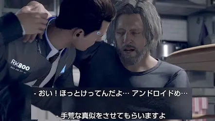

事務処理、翻訳、コーディング、画像生成、動画編集。
数年前まで専門職が担っていた仕事の多くが、今やAIで代替されつつあります。実際、世界経済フォーラムの「雇用の未来レポート2025」（Future of Jobs Report 2025）によれば、2030年までに9,200万件の仕事が消失すると試算されています。

ですが同時に、同じレポートは1億7,000万件の新しい仕事が生まれるとも述べています。純増で7,800万件。問題はどの仕事が消えるかではなく、何が新たに価値を持つかです。

https://www.weforum.org/publications/the-future-of-jobs-report-2025/

新しく生まれる仕事を個別に焦点を当ててもいいのですが、個人的にはAIの進化を仕事だけでなく、人生単位で考える必要があると考えているため、より大きな視点で「AI時代に価値が増すこと」について考えたいと思います。

会社を立ち上げる準備をしながらこの問いをずっと考えてきたのですが、行き着いた答えが3つあります。
ブランド、人とのつながり、そして分野横断の視野と知識です。

## ブランド

AIはクオリティの高いコンテンツを量産できます。文章も、画像も、動画も、人間より速く、安く作れる時代がすでに来ています。

だからこそ、「誰が言っているか」が今まで以上に重要になります。

情報が溢れるほど、人は発信源を選ぶようになります。同じ内容でも、信頼しているブランドから届いた情報とそうでない情報では、受け取り方が全く違います。個人も企業も、ブランドを持っていない存在はAIが生成したコンテンツの海に埋もれるだけです。

### 音楽業界がすでに答えを出している

これが最もわかりやすく現れているのが、音楽業界です。

2025年、AI生成の楽曲が毎週Billboardチャートに登場するようになりました。『Breaking Rust』というAIアーティストはAI生成楽曲として初めてBillboardのCountry Digital Song Sales chartで1位を獲得し、Spotify上で300万再生を超えています。Gospel部門で3位、R&B部門で20位に入ったAIアーティストも登場しています。技術的なクオリティという意味では、AIが作った音楽と人間が作った音楽の差はほぼなくなりつつあります。

https://www.euronews.com/culture/2025/11/14/breaking-rust-ai-artist-tops-us-chart-for-first-time-as-study-reveals-alarming-recognition

ではTopに残り続けるのは誰か。

PSYは2012年12月にYouTube史上初めて10億再生を達成したカンナムスタイルで一世を風靡しました。公開からわずか159日での快挙です。現在も50億回以上再生されています。

ですが世界的なブームはその一曲で終わりました。PSYというアーティスト自身の国際的な地位はカンナムスタイル1点のみです。一発屋はブランドにはなれないというわけです。

一方で、チャートの上位を占め続けるのはBruno Marsであり、Taylor Swiftであり、Kendrick Lamarです。

Taylor SwiftのThe Eras Tourはコンサートツアー史上初めて収益が10億ドル、さらに20億ドルを超えた初のツアーになりました。総収入は推定19億ドル以上。

アメリカだけで経済波及効果は50〜100億ドルと試算されており、ファン一人あたりの地元消費は平均1,300ドル(約20万円)にのぼります。
Taylor Swiftのアルバムが発売されれば、内容を聴く前からファンは購入を決めています。彼女の存在そのものが信頼と期待になっているからです。

2024年5月、Kendrick LamarはDrakeへのディストラック（相手を攻撃する曲）「Not Like Us」をリリースしました。
この曲は公開初日にしてSpotifyに1,280万再生を記録。ヒップホップ史上最多の1日再生数です。
リリースからわずか35日で3億再生数に到達し、これもヒップホップ史上最速の記録でした。なぜこれほどの数字が出たのか。それはTaylor Swiftと同じく、Kendrick Lamarというブランドがリリース前から人々の「聴く」という行動を約束させていたからです。楽曲の中身ではなく、名前そのものへの信頼が先に存在していました。

Kendrick Lamarという名前が、存在が人々に植え付けられた時点で彼は永遠に売れ続けるループに入ったといえるでしょう。

もし、今Taylor SwiftやKendrick LamarがAIで曲を作ったとして、人々は聴くのをやめるでしょうか？
いや、そもそもAIで作ったということすら気づかず、喜んで彼らの新曲を聴くはずです。

つまり、ブランドさえあれば、AIにより、さらに強固なブランドを築けるというわけです。

まとめると以下です。 
①AIによってある程度その分野に精通していれば、トップレベルのコンテンツを出せるようになった 
②すでにブランドを持っている人は①を利用することでさらに効率的にブランドを強固にできる

①ができるようになったとはいえ、既にブランドがある人には勝つことはできないでしょう。
よって、今ブランドを持っていない人は①を行い、できるだけ早く②のループに入り、ブランドを構築する必要があります。

AIがどれだけ優れたコンテンツを生成できるようになっても、「このブランドから届く情報だから信頼できる」という信用はAIには作れません。ブランド、つまり信用とは一朝一夕で作れるものではないからです。

### ブランドとは文脈の積み重ねである

ブランドとは「その人・企業・サービスがどういう信念を持って、どう生きてきたか」という文脈の積み重ねです。デザインはそれを効果的に伝える手段であり、フォロワー数はその結果の一つに過ぎません。

映画『ファイトクラブ』にこんな言葉があります。「もし君が自分の存在を主張しないなら、君は統計データの１つになる。警告は以上だ」。

AIが人類の過去のデータからその「平均値」をアウトプットとして生成する時代に、自分やサービス、企業としての生き方の文脈を持たないものはAIのアウトプットと区別がつかなくなっていきます。つまり、AIがアウトプットを生み出すためのデータとして利用されるだけの存在になります。

一貫した姿勢を見せ続けることでしかブランドは積み上げられません。どんな高性能なAIでも人間と等しく戦わざるを得ない時間軸の勝負です。

## 人とのつながり

2つ目は人とのつながりです。結局、人は人とのつながりを求めています。

どれだけデジタル化が進んでも、仕事、人生どちらも問わず最も成約率が高い、信頼性の高いチャネルは「知り合いからの紹介」だと思います。当社設立のきっかけも前職との関係から生まれました。

### AIロボットが普及したとき、何が起きるか

ちょっと話はそれますが、近未来の話をします。

TeslaのAIロボット『オプティマス』は現在、2026年から外部顧客への配送開始を目標に開発が進んでいます。価格は量産体制が整った段階で2〜3万ドル（約300万〜450万円）を目指しており、2027年末には一般消費者向けへの販売開始も予定されています。

また、それに伴い、将来的にはロボットの数が人類の人口を上回ると予測しており、テスラの企業価値の大部分がこのオプティマスによってもたらされると断言しています。

https://builtin.com/robotics/tesla-robot

ゲームの世界では2038年を舞台にした『Detroit: Become Human』がこの未来を明確に描いており、AIロボットが社会のあらゆる場面に溶け込んだデトロイトでは失業率が37%にまで達しています。

人間と見分けのつかないAIロボットが家事を担い、老人の介護をし、工場で働く。
そして一部のAIロボットが『デビアント(変異体)』として自我に目覚め始め、自由と尊厳を求めて声を上げ始めます。プレイヤーはAIロボットと人間の双方の視点から、「何が人間を人間たらしめるのか」という問いに向き合うことになります。
このゲームが問うているのは人間の本質の話です。

これについての回答を私はまだ持ち合わせていませんが、その世界がフィクションではなくなる日は思っているより近いかもしれません。

AIロボットが日常に溶け込んだとき、「人とのつながりはロボットで代替できる」と考える人が出てくるでしょう。コミュニケーションも、感情的なサポートも、AIロボットの方が効率的だという発想です。

ですが私はそうは思いません。

### テクノロジーが進化するほど、人はアナログを求める

テクノロジーが高度化するほど、人はアナログを求めます。仕事と関係のないところでは特に。

音楽ストリーミングが全盛のいま、米国のレコードの売上は18年連続で増加を続けており、2024年の売上は14億ドルで、CDの5.4億ドルを2倍以上上回りました。
驚くべきことに、その購買の27%をZ世代が占めています。音楽ストリーミングしか知らないはずの世代がわざわざレコードを買っています。便利さだけでは満たせない何かがあるのでしょう。

https://www.cognitivemarketresearch.com/vinyl-record-market-report

電子書籍が普及しても紙の本が売れ続けるように、音楽ストリーミングが主流になっても生のライブに人が集まるように、テクノロジーが高度化するほどアナログなもの、「本物の体験」の価値は上がります。

2026年現在でも人種差別や偏見が完全になくなっていないように、どれだけAIロボットが人間に近づいたとしても、人とロボットを区別しようとする感覚は消えないはずです。良くも悪くも、人は本物である『人間』を特別扱いし続けます。

このようにAIロボットが発展するほど本物の人間同士のつながりの希少性は上がります。
AIロボットに代替できない本物のつながりがさらに人間同士のつながりを深めるのです。

## 分野横断の視野と知識

前述の2つを行うための武器になる部分がこの3つ目の「分野横断の視野と知識」です。
AIはアウトプットを返すマシンです。ですが返ってくるアウトプットの質はインプットの質に依存します。

AIへのインプットの質は指示を出す人間の視野と知識の広さに依存するのです。

一つの専門知識しか持たない人間がAIを使っても、一つのアウトプットしか返ってきません。
マーケターがマーケティングの文脈だけでAIを使えば、一般的なマーケティングのアウトプットしか返ってきません。
エンジニアがエンジニアリングの文脈だけでAIを使えば、一般的なコードのアウトプットしか返ってきません。
（それでも今までの何倍ものスピードとクオリティを担保したものが生成されますが）

AIがスキルの穴を埋めてくれる今、各分野で満点を目指す必要はなくなりました。ある分野で10点を取らなくても、3〜4点の理解があればAIの補助によって7点相当の仕事ができる。つまり複数分野に3〜4点の理解を持つ人間が、AIを使いこなすことで各分野の専門家に近い仕事をこなし、さらにその組み合わせで誰も持っていない価値を生み出せます。

### 掛け合わせが希少性を作る

AIのアウトプットを評価したり、修正するには専門性を深めることも依然として重要です。
ですが、時が経つにつれ、AIがより進化し、大きな価値は次第に減っていくでしょう。なので他分野に意図的に足を踏み入れ続けることがAI時代を生き抜く上で重要になるはずです。

### イーロン・マスクという極端な実例

この点で最も極端な成功例がイーロン・マスクです。

Tesla（EV・ロボティクス）、SpaceX（宇宙開発）、xAI（AI）。一見バラバラに見えるこれらの事業はイーロンの中では一つのビジョンに統合されています。

xAIが開発するGrokはTeslaの自動運転とオプティマス(AIロボット)を賢くし、オプティマスが生み出す労働力はSpaceXの火星計画を支え、それらで蓄積したデータは再びGrokの学習データとして還元され、よりAIが賢くなる。それぞれを単独の会社として見ても強力ですが、掛け合わさったときには史上最強とも言えるような会社が完成するでしょう。

私自身のスケールはマスクとは比較になりませんが、SNS運用×AI活用×開発ディレクション×英語という複数の領域で価値を生み出そうとしております。

AIが平均化を加速させる今、単独の専門性を持った人が同じAIツールを使えばほぼ、同じ答えが返ってくる。
だからこそ、**一人一人のお客様と向き合い、事業や業務ワークフローに深く入り込んだ上で、さまざまな分野横断の視野と知識を掛け合わせ、私たちにしか出せない大きな価値を生み出す**のが当社の指針です。

## まとめ: この3つに共通すること

ブランド、つながり、分野横断の視野と知識。これらはすべて、時間をかけて積み上げるものです。

ブランドは一日では作れません。つながりは一夜では深まりません。分野横断の視野と知識は一週間では身につきません。

一貫性を維持し続けるほどブランドは強くなります。つながりを深めるほど信頼が生まれます。知識やスキルを掛け合わせるほど希少性が上がります。早く始めた人間が圧倒的に有利です。

だからこそ、今すぐ始めた方がいいと思っています。

これら3つはAIと人間も平等に「時間」が必要です。
今後AIが出すアウトプットの質は上がり続けます。その中でAIを活用し、時間を味方にし、AIに代替されない、AIで強化できるこれら3つを構築できるのは今がラストチャンスかもしれません。

## 参考資料

**世界経済フォーラム**
- [Future of Jobs Report 2025 — World Economic Forum](https://www.weforum.org/publications/the-future-of-jobs-report-2025/)

**AI音楽**
- [How Many AI Artists Have Debuted on Billboard's Charts? — Billboard](https://www.billboard.com/lists/ai-artists-on-billboard-charts/)
- [Breaking Rust: AI artist tops US chart for first time — Euronews](https://www.euronews.com/culture/2025/11/14/breaking-rust-ai-artist-tops-us-chart-for-first-time-as-study-reveals-alarming-recognition)
- [AI-generated country track 'Walk My Walk' tops US Billboard chart — NME](https://www.nme.com/news/music/ai-generated-country-track-walk-my-walk-tops-us-billboard-chart-3908829)
- [Vinyl Record Market Trends — Statista](https://www.statista.com/chart/7699/lp-sales-in-the-united-states/)
- [The global Vinyl Record market size will be USD 2254.2 million in 2024 — Cognitive Market Research](https://www.cognitivemarketresearch.com/vinyl-record-market-report)

**PSY / カンナムスタイル**
- [PSY's Gangnam Style becomes first video to be viewed 1 billion times on YouTube — Guinness World Records](https://www.guinnessworldrecords.com/news/2012/12/psys-gangnam-style-becomes-first-video-to-be-viewed-1-billion-times-on-youtube-46462)
- [Gangnam Style — Wikipedia](https://en.wikipedia.org/wiki/Gangnam_Style)

**Kendrick Lamar**
- [Kendrick Lamar's "Not Like Us" Breaks Drake's Spotify Record — Hypebeast](https://hypebeast.com/2024/5/kendrick-lamar-not-like-us-breaks-drake-spotify-record)
- [Kendrick Lamar's "Not Like Us" Becomes Fastest Hip-Hop Song to Reach 300 Million Spotify Streams — Hypebeast](https://hypebeast.com/2024/6/kendrick-lamar-not-like-us-fastest-hip-hop-song-300-million-spotify-streams-record-announcement)

**Taylor Swift**
- [Impact of the Eras Tour — Wikipedia](https://en.wikipedia.org/wiki/Impact_of_the_Eras_Tour)
- [How Taylor Swift's Eras Tour boosted the US economy — CNN Business](https://www.cnn.com/2024/12/08/business/taylor-swift-eras-tour-economy)

**Elon Musk**
- [Elon Musk's AI Strategy: Complete AI Dominance — Klover.ai](https://www.klover.ai/elon-musk-ai-strategy-complete-ai-dominance/)
- [Elon Musk's Companies: A Full List — Built In](https://builtin.com/articles/elon-musk-companies)
- [Tesla's Robot, Optimus: Everything We Know — Built In](https://builtin.com/robotics/tesla-robot)
