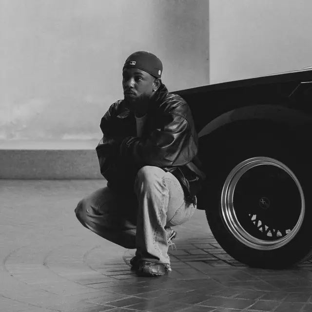
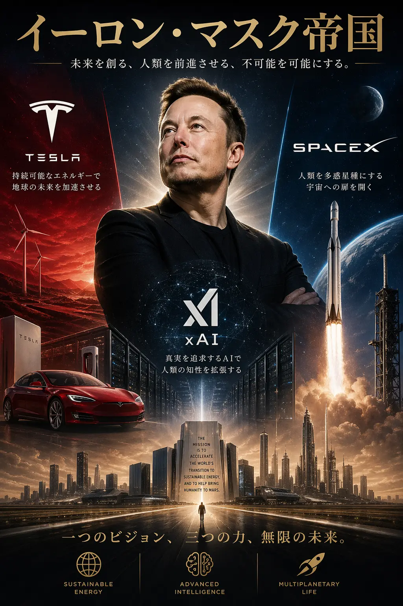

Administrative work, translation, coding, image generation, video editing. Many jobs once held by specialists are now being replaced by AI. According to the World Economic Forum's *Future of Jobs Report 2025*, an estimated 92 million jobs will disappear by 2030.

At the same time, the same report predicts the creation of 170 million new jobs — a net gain of 78 million. The real question isn't which jobs will vanish, but what will gain new value.

https://www.weforum.org/publications/the-future-of-jobs-report-2025/

We could examine each emerging job category individually, but I believe AI's evolution needs to be considered not just in terms of work, but across our entire lives. So I want to think from a broader perspective: *what gains value in the age of AI?*

I've been wrestling with this question while building this company, and I've arrived at three answers: **brand**, **human connections**, and **cross-domain perspective and knowledge**.

## Brand

AI can produce high-quality content at scale. Text, images, video — the era of AI creating them faster and cheaper than humans is already here.

That's precisely why *who is saying it* matters more than ever.

The more information floods the world, the more people become selective about their sources. Even the same message lands differently depending on whether it comes from a trusted brand or an unknown voice. Individuals and companies without a brand will simply be buried in the ocean of AI-generated content.

### The Music Industry Already Has the Answer

Nowhere is this clearer than in the music industry.

In 2025, AI-generated tracks started appearing on Billboard charts weekly. An AI artist called *Breaking Rust* became the first AI artist to reach #1 on Billboard's Country Digital Song Sales chart, surpassing 3 million Spotify streams. AI artists also charted at #3 in Gospel and #20 in R&B. In terms of technical quality, the gap between AI-made and human-made music is nearly gone.

https://www.euronews.com/culture/2025/11/14/breaking-rust-ai-artist-tops-us-chart-for-first-time-as-study-reveals-alarming-recognition

So who stays at the top?

PSY took the world by storm with *Gangnam Style*, which became the first YouTube video to hit 1 billion views in December 2012 — just 159 days after release. It now sits at over 5 billion views.

But the global phenomenon ended with that one song. PSY's international standing rests entirely on *Gangnam Style*. A one-hit wonder cannot become a brand.

Meanwhile, those who continue to dominate the charts are Bruno Mars, Taylor Swift, and Kendrick Lamar.

Taylor Swift's Eras Tour became the first concert tour in history to surpass $1 billion in revenue — and then $2 billion — with total estimated earnings exceeding $1.9 billion. Its estimated economic impact in the US alone is $5–10 billion, with each fan spending an average of $1,300 locally. When Taylor Swift releases an album, fans have already decided to buy it before they've heard a single note. Her very existence *is* trust and expectation.

In May 2024, Kendrick Lamar released "Not Like Us," a diss track targeting Drake. On its first day, it logged 12.8 million Spotify streams — the most in hip-hop history for a single day. It hit 300 million streams in just 35 days, also the fastest ever in hip-hop. Why? Because just like Taylor Swift, Kendrick Lamar's brand had already committed millions of people to listening before the release. The trust existed in the *name*, not the content.

Once Kendrick Lamar's name — his presence — is embedded in people's minds, he enters an eternal loop of continued success.

If Taylor Swift or Kendrick Lamar used AI to make their next record, would people stop listening? No — they probably wouldn't even notice it was AI-made. They'd happily consume the new material anyway.

In other words, *with a brand, AI only makes that brand stronger*.

To summarize: 
① AI now makes it possible for anyone with reasonable domain knowledge to produce top-tier content 
② Those who already have a brand can use ① to reinforce it more efficiently than ever

Even though ① is now within reach, it won't help you beat someone who already has a brand. So if you don't have one yet, you need to use ① to enter the ② loop as quickly as possible.

No matter how good AI gets at generating content, it cannot manufacture the trust that comes from "I believe this because it's from *that* brand." Trust cannot be built overnight.

### Brand Is an Accumulation of Context

A brand is the accumulated context of how a person, company, or service has lived — what they believe, what they've built, how they've shown up. Design is a vehicle for communicating that context effectively. Follower counts are just one of its outputs.

*Fight Club* has a memorable line: "If you don't claim your humanity, you will become a statistic. Warning is over."

In an era where AI generates outputs as the "average" of all past human data, anything — any person, service, or company — that lacks a coherent narrative about how it exists will become indistinguishable from AI output. It will simply become raw data for AI to learn from.

Brand can only be built through sustained consistency. This is a competition measured in time — one where even the most powerful AI must compete on equal footing with humans.

## Human Connections

The second is human connections. Ultimately, people need people.

No matter how digitalized things become, the highest-trust, highest-conversion channel — for business and for life — is a referral from someone you know. KCP itself was born from a relationship with a former employer.

### What Happens When AI Robots Become Commonplace?

Let me take a slight detour and talk about the near future.

Tesla's AI robot *Optimus* is currently being developed with a target of beginning deliveries to external customers in 2026. The target price is $20,000–$30,000 at scale, with general consumer sales planned for the end of 2027.

Tesla has also predicted that the number of robots will eventually surpass the human population — and has stated definitively that a large share of Tesla's value will come from Optimus.

https://builtin.com/robotics/tesla-robot

The 2018 video game *Detroit: Become Human*, set in 2038, depicts this future vividly. In its version of Detroit — where AI robots have integrated into every facet of society — the unemployment rate has reached 37%.

AI robots indistinguishable from humans are doing housework, caring for the elderly, working in factories. Some "deviant" robots begin to develop self-awareness and demand freedom and dignity. Players navigate the story from the perspectives of both robots and humans, confronting the question: *what makes a human, human?*

I don't yet have a full answer to that. But the day that world ceases to be fiction may be closer than we think.

When AI robots blend into daily life, some will argue that human connections can be replaced by robots — that AI is more efficient at communication and emotional support.

I disagree.

### The More Technology Advances, the More People Seek the Analog

The more sophisticated technology becomes, the more people crave analog experiences — especially outside of work.

In an era of music streaming dominance, vinyl record sales in the US have grown for 18 consecutive years. In 2024, vinyl revenue reached $1.4 billion, more than double the $540 million earned by CDs. Remarkably, 27% of vinyl buyers are Gen Z — the generation that grew up knowing only streaming. Something beyond mere convenience is clearly at work.

https://www.cognitivemarketresearch.com/vinyl-record-market-report

Just as physical books continue to sell despite e-books, just as people still fill concert halls despite streaming, the more advanced technology becomes, the more the value of analog experiences — of *real* experiences — rises.

Just as racial prejudice and bias haven't fully disappeared by 2026, no matter how human-like AI robots become, our instinct to distinguish people from machines won't disappear. For better or worse, humans will continue to treat real humans as special.

As AI robots develop further, the scarcity of genuine human connections only increases. The bonds that cannot be replicated by AI robots will deepen human relationships even further.

## Cross-Domain Perspective and Knowledge

The third item — cross-domain perspective and knowledge — is the weapon that enables the first two.

AI is an output machine. But the quality of the output depends on the quality of the input.

And the quality of the input depends on the breadth of the perspective and knowledge of the person giving the instructions.

Someone with expertise in only one area who uses AI will only get one type of output. A marketer who uses AI purely within a marketing context will only get generic marketing results. An engineer who uses AI only within an engineering context will only get generic code — though even that will be produced at several times the speed and quality of before.

Now that AI fills in skill gaps, you don't need to score 100 in any single domain. Even a 3–4/10 understanding in a field, with AI assistance, can bring you to 7/10 performance. Someone with 3–4/10 understanding across multiple domains, wielding AI effectively, can do the work of near-specialists in each — and combine them to create value that nobody else can.

### Combinations Create Scarcity

Deepening specialization still matters for evaluating and correcting AI outputs. But as AI evolves further, the value of narrow specialization alone will gradually decline. Deliberately stepping into other fields — continuously — is what it will take to thrive in the AI era.

### Elon Musk as an Extreme Example

The most extreme example of this is Elon Musk.

Tesla (EVs and robotics), SpaceX (space exploration), xAI (AI). These ventures look unrelated at first glance, but in Elon's mind they're unified under one vision.

xAI's Grok makes Tesla's self-driving and Optimus smarter. The labor generated by Optimus supports SpaceX's Mars ambitions. The data accumulated from all of these feeds back into Grok's training, making the AI smarter still. Each company is powerful on its own — but combined, they form what may be the most formidable business empire in history.

My own scale is incomparable to Musk's, but I'm working to create value at the intersection of social media operations, AI utilization, development direction, and English — multiple domains in combination.

As AI accelerates the homogenization of outputs, two people with the same narrow specialty using the same AI tools will produce nearly identical results.

That's why **our approach is to engage deeply with each client — to understand their business and operational workflows at a granular level — and then apply cross-domain perspective and knowledge to generate value that only we can produce**.

## In Summary: What These Three Have in Common

Brand, connections, cross-domain perspective and knowledge. All three are built over time.

A brand cannot be built in a day. Connections cannot deepen in a night. Cross-domain perspective and knowledge cannot be cultivated in a week.

The longer you maintain consistency, the stronger your brand becomes. The deeper your connections, the more trust is built. The more you combine knowledge and skills, the more scarce and valuable you become. Those who start early have an overwhelming advantage.

That's why I believe you should start now.

These three things share one thing with AI: they all require time. AI outputs will keep improving in quality. The window to leverage AI, make time your ally, and build these three things — things that AI cannot replace and can in fact amplify — may be closing faster than we realize.

## References

**World Economic Forum**
- [Future of Jobs Report 2025 — World Economic Forum](https://www.weforum.org/publications/the-future-of-jobs-report-2025/)

**AI Music**
- [How Many AI Artists Have Debuted on Billboard's Charts? — Billboard](https://www.billboard.com/lists/ai-artists-on-billboard-charts/)
- [Breaking Rust: AI artist tops US chart for first time — Euronews](https://www.euronews.com/culture/2025/11/14/breaking-rust-ai-artist-tops-us-chart-for-first-time-as-study-reveals-alarming-recognition)
- [AI-generated country track 'Walk My Walk' tops US Billboard chart — NME](https://www.nme.com/news/music/ai-generated-country-track-walk-my-walk-tops-us-billboard-chart-3908829)
- [Vinyl Record Market Trends — Statista](https://www.statista.com/chart/7699/lp-sales-in-the-united-states/)
- [The global Vinyl Record market size will be USD 2254.2 million in 2024 — Cognitive Market Research](https://www.cognitivemarketresearch.com/vinyl-record-market-report)

**PSY / Gangnam Style**
- [PSY's Gangnam Style becomes first video to be viewed 1 billion times on YouTube — Guinness World Records](https://www.guinnessworldrecords.com/news/2012/12/psys-gangnam-style-becomes-first-video-to-be-viewed-1-billion-times-on-youtube-46462)
- [Gangnam Style — Wikipedia](https://en.wikipedia.org/wiki/Gangnam_Style)

**Kendrick Lamar**
- [Kendrick Lamar's "Not Like Us" Breaks Drake's Spotify Record — Hypebeast](https://hypebeast.com/2024/5/kendrick-lamar-not-like-us-breaks-drake-spotify-record)
- [Kendrick Lamar's "Not Like Us" Becomes Fastest Hip-Hop Song to Reach 300 Million Spotify Streams — Hypebeast](https://hypebeast.com/2024/6/kendrick-lamar-not-like-us-fastest-hip-hop-song-300-million-spotify-streams-record-announcement)

**Taylor Swift**
- [Impact of the Eras Tour — Wikipedia](https://en.wikipedia.org/wiki/Impact_of_the_Eras_Tour)
- [How Taylor Swift's Eras Tour boosted the US economy — CNN Business](https://www.cnn.com/2024/12/08/business/taylor-swift-eras-tour-economy)

**Elon Musk**
- [Elon Musk's AI Strategy: Complete AI Dominance — Klover.ai](https://www.klover.ai/elon-musk-ai-strategy-complete-ai-dominance/)
- [Elon Musk's Companies: A Full List — Built In](https://builtin.com/articles/elon-musk-companies)
- [Tesla's Robot, Optimus: Everything We Know — Built In](https://builtin.com/robotics/tesla-robot)
